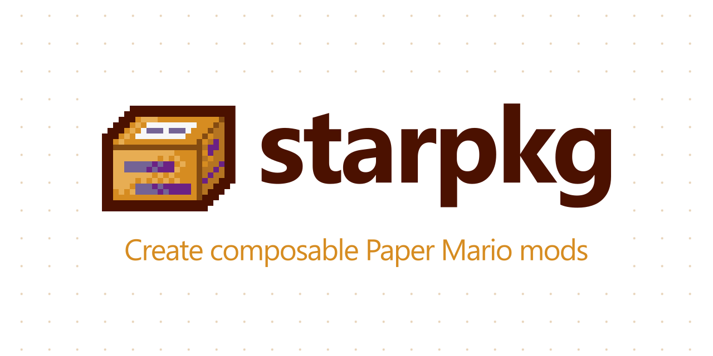

    
    
    
    
    
    

<h3 align="center">
    <a href='https://imalex.xyz/starpkg'>To get started, view the user guide.</a>
</h3>

<h6 align="center">
    Paper Mario is a trademark of Nintendo of America Inc. Neither starpkg nor its authors are associated with Nintendo.
</h6>
